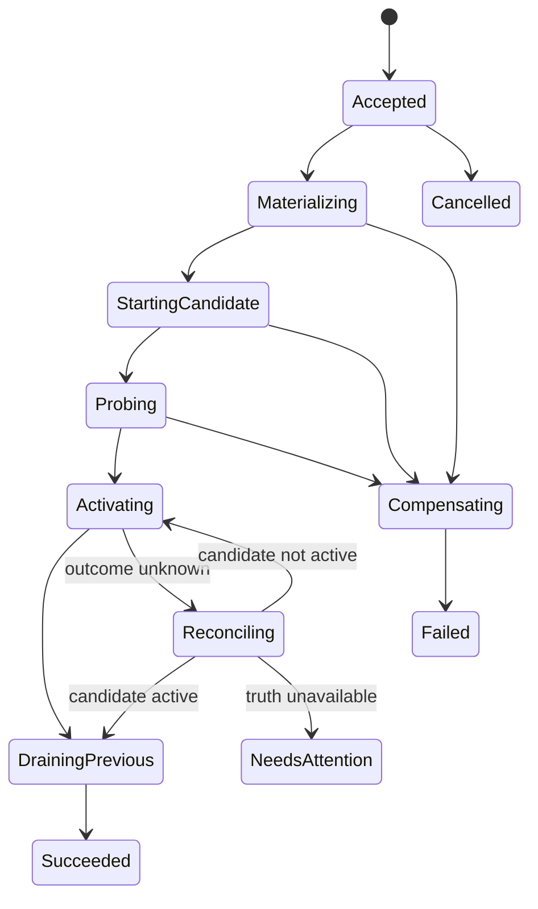

# Durable Deployment Controller

> [English](./DURABLE_DEPLOYMENT_CONTROLLER.en.md) · [中文](./DURABLE_DEPLOYMENT_CONTROLLER.md)

Status: **Candidate implementation**. Phase 2 establishes the durable local-deployment baseline behind the existing deployment facades. The first-class intent/operation/step-receipt contract, failure-injection gate, bounded restart policy, and remote-target implementation remain incomplete.

Implementation snapshot (2026-07-23):

- one contiguous deployment journal now uses sequence CAS, while revision activation also fences on the expected parent revision;
- build output is resolved to a content-addressable Docker image ID before deployment;
- build-deploy, recover, rollback, and project-owned direct deploy use candidate-first readiness, lease-guarded route promotion, and post-commit draining of the previous instance;
- deployment authority is persisted without credentials and revalidated, together with the single Host control-plane lease, before each new long-running effect;
- startup restores durable route ownership, observes real Docker labels, cleans uncommitted candidates, and preserves stale state when Docker observation is unavailable.

## Goal and invariants

The controller converges user-declared desired state with target-reported observed state through audited, idempotent, fenced operations.

The following always hold:

- Build and Deploy are separate; deployment consumes immutable artifact/image descriptors.
- Journals rebuild control-plane projections, but journal replay never means effect re-execution.
- A healthy active revision continues serving until a candidate passes policy and activates.
- retry, cancel, recover, and rollback share the operation/receipt model.
- automatic restart derives from durable desired state and explicit policy, never an implicit health-thread command.
- Docker, port, and tunnel details remain target adapters outside the constitutional substrate.

## Records

### ArtifactDescriptor

```text
ArtifactDescriptor
  digest
  media_type
  size?
  source_revision?
  build_descriptor_hash?
  provenance_ref
  created_at
```

A convenience build-deploy API may remain, but it first persists a terminal Build record and ArtifactDescriptor before creating a DeploymentIntent.

### DeploymentIntent

```text
DeploymentIntent
  project_ref
  target_ref
  generation
  artifact_ref
  executor_profile
  env_secret_refs[]
  mounts[]
  ingress_spec
  health_policy
  restart_policy
  rollout_strategy
  created_by / authority_ref
```

Intent never stores raw secrets. Changes create a higher immutable generation.

### DeploymentRevision

A revision is a resolved intent snapshot with exact artifact, route, lease, policy, and provenance references. Rollback creates a new intent from an old revision rather than mutating history.

### DeploymentOperation

```text
DeploymentOperation
  id
  project_ref / target_ref / generation
  kind: apply | recover | rollback | stop | reconcile
  phase / status
  idempotency_key
  lease_owner / lease_epoch / lease_expires_at
  attempt / next_retry_at?
  cancellation_requested_at?
  correlation / causation
```

Only one operation per project × target may change the active generation. Workers acquire a CAS/compare-and-append lease; stale epochs are rejected by controller and target.

### ObservedDeployment

Observed state comes from the target: actual entities, artifact digest, health, ports, route, agent ledger, last observation, and fencing epoch. Unknown, offline, and incompatible are explicit states, not aliases for Failed or Removed.

## Apply state machine



Each phase advances only after its terminal effect receipt is durable. Requests carry operation id, step id, generation, and lease epoch; duplicates return the same receipt or current state.

## Safe activation

The default HTTP-container strategy is candidate-first:

1. retain the active revision, route, and lease;
2. allocate a separate candidate entity and actual port;
3. execute declared readiness policy;
4. atomically switch the route active pointer;
5. observe activation and persist its receipt;
6. drain and reclaim the previous revision.

Pre-activation failures only compensate the candidate. An unknown activation outcome keeps both versions until route/target truth is reconciled.

Initial strategies are `candidate_first` and explicit-downtime `recreate`. The controller never silently degrades candidate-first into recreate.

## Effect discipline

```text
EffectReceipt
  operation_id / step_id / attempt
  target_ref / lease_epoch
  effect_kind / request_digest
  terminal_status / observed_refs[]
  started_at / finished_at
  diagnostic_ref?
```

A receipt proves what a target reported, not absolute remote truth. Target identity, fencing, and later observation establish confidence.

## Recovery and reconciliation

On Host startup or target reconnect:

1. hydrate intent, revision, operation, route pointer, and receipts;
2. mark non-terminal operations Reconciling without replaying them;
3. query target entities and operation ledger;
4. compare generation, digest, receipt, and epoch;
5. continue, compensate, adopt completed effects, or enter NeedsAttention;
6. create effects only after acquiring a fresh lease.

An unavailable observation source is never interpreted as an absent entity. Local Docker and remote agents provide real truth sources.

## Restart policy

```text
RestartPolicy
  mode: never | on_failure | always
  max_attempts / window
  initial_backoff / max_backoff
  reset_after_healthy
```

Health supervision only updates observation and audit. The controller creates a recover operation from desired state and retry budget. Exhaustion enters CrashLoopBackoff.

## Retention and GC

- active, previous, in-operation, and pinned revision artifacts are reachable;
- rollback is offered only while artifacts, secret refs, and executor compatibility remain satisfiable;
- diagnostic and log artifacts have policy-controlled retention;
- orphan scans propose audited cleanup before deletion;
- secret lifetime is independent of artifact reachability.

## Failure matrix

| Failure | Required behavior |
|---|---|
| Candidate start fails | Active unchanged; candidate compensated |
| Readiness timeout | Active unchanged; bounded diagnostics retained |
| Host dies before switch | Query route/target; do not create another candidate |
| Switch response is lost | Reconcile active pointer before action |
| Old stop fails after switch | New remains active; cleanup warning and retry |
| Target is offline | Pause/reconcile; do not fabricate a terminal receipt |
| Stale worker resumes | Reject stale lease epoch |
| Rollback artifact was collected | Reject before effects with explicit missing refs |
| Repeated Host restarts | Idempotency and ledger converge to one valid entity set |

## Public contract

Canonical Host candidates include `host.deployment.intent.*`, `host.deployment.operation.*`, `host.deployment.revision.*`, observation, and operation streams. Existing build-deploy/recover/rollback routes become facades. `kernel.v1.port/proxy/exec` remain adapters rather than orchestration ontology.

## Implementation order

1. Add intent, operation, lease, and receipt projections; dual-write old flow without behavior change.
2. Separate build/deploy records and route recover/rollback through operations.
3. Add real local-target observation and an idempotent step ledger.
4. Implement candidate-first and atomic route activation.
5. Reconcile on startup; enable bounded restart only after failure-injection coverage.
6. Migrate clients and stop creating legacy-shaped deployments.

The current Candidate baseline covers the local observation, candidate-first, guarded activation, and startup-reconciliation portions of steps 3-5 through the legacy facades. It deliberately does not claim the completion gate below.

## Completion gate

- Host kill/restart at every transition converges without duplicate effects.
- The old version serves until the candidate is healthy.
- Lost activation responses, offline targets, and stale workers recover conservatively.
- recover, rollback, cancel, and restart share operations and receipts.
- local and future remote targets pass the same semantic conformance.
