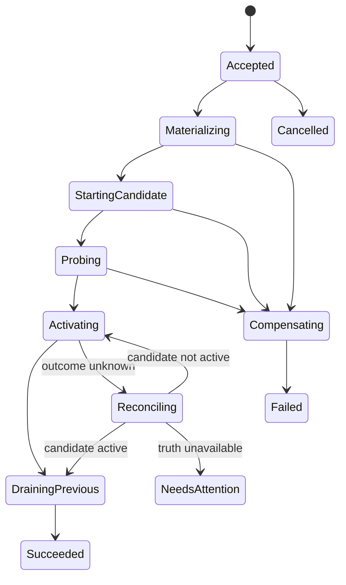

# 可恢复部署控制器

> [English](./DURABLE_DEPLOYMENT_CONTROLLER.en.md) · [中文](./DURABLE_DEPLOYMENT_CONTROLLER.md)

状态：**Candidate 实现**。Phase 2 已在现有部署 facade 背后建立本地持久部署基线；一等 intent/operation/step-receipt 合同、故障注入门槛、有界 restart policy 和 remote target 实现仍未完成。

当前实现快照（2026-07-23）：

- 单一连续 deployment journal 使用 sequence CAS，revision 激活同时按预期 parent revision fencing；
- 构建输出在部署前解析为内容寻址的 Docker image ID；
- build-deploy、recover、rollback 和有项目归属的 direct deploy 统一采用 candidate-first readiness、按 lease 守卫的 route promotion，以及日志提交后再排空旧实例；
- 长部署 authority 在不持久化凭据的前提下进入日志，并在每个新副作用前与唯一 Host 控制面 lease 一起重新校验；
- 启动时恢复持久 route ownership、读取真实 Docker label、清理未提交 candidate；Docker 无法观测时保留 stale 状态而不假定资源消失。

## 目标与不变量

部署控制器维护用户声明的期望状态与 target 报告的实际状态，并通过可审计、幂等、有 fencing 的操作让两者收敛。

必须始终成立：

- Build 与 Deploy 分离；部署只消费不可变 artifact/image descriptor；
- journal 可以重建控制面投影，但重放 journal 绝不等于重做副作用；
- 已健康的 active revision 在 candidate 通过检查并成功激活前继续服务；
- retry、cancel、recover 和 rollback 使用同一 operation/receipt 模型；
- 自动重启来自持久 desired state 与明确 restart policy，不来自健康线程里的隐式命令；
- target-specific Docker、端口和隧道细节不进入 constitutional substrate。

## 领域记录

### ArtifactDescriptor

构建输出是不可变描述符：

```text
ArtifactDescriptor
  digest
  media_type
  size?
  source_revision?
  build_descriptor_hash?
  provenance_ref
  created_at
```

便利的 `build-deploy` API 可以保留，但内部必须先落下 terminal Build record 和 ArtifactDescriptor，再创建 DeploymentIntent。

### DeploymentIntent

用户希望运行的版本化期望状态：

```text
DeploymentIntent
  project_ref
  target_ref
  generation
  artifact_ref
  executor_profile
  env_secret_refs[]
  mounts[]
  ingress_spec
  health_policy
  restart_policy
  rollout_strategy
  created_by / authority_ref
```

Intent 不保存 secret 明文。每次修改创建更高 generation；历史 generation 不可变。

### DeploymentRevision

Revision 是 intent 的已解析快照，包含精确 artifact、route、lease、policy 和 provenance 引用。Rollback 选择以前的 revision 作为新 intent 的来源，而不是修改历史 revision。

### DeploymentOperation

```text
DeploymentOperation
  id
  project_ref / target_ref / generation
  kind: apply | recover | rollback | stop | reconcile
  phase
  status
  idempotency_key
  lease_owner / lease_epoch / lease_expires_at
  attempt / next_retry_at?
  cancellation_requested_at?
  correlation / causation
```

一个 project × target 同时只有一个可改变 active generation 的 operation。数据库 compare-and-append 或 CAS 获取 lease；旧 epoch 的 worker 和 target 请求必须被拒绝。

### ObservedDeployment

Observed state 来自 target，而不是由 intent 推断：实际执行实体、artifact digest、健康、端口、route、agent operation ledger、最后观测时间和 fencing epoch。未知、离线和不兼容是明确状态，不能伪装成 Failed 或 Removed。

## Apply 状态机



每个 phase 只能在对应 terminal effect receipt 被持久化后前进。外部 effect 请求携带 operation id、step id、generation 和 lease epoch；重复请求返回相同结果或当前状态。

## 安全激活

默认 HTTP 容器策略是 candidate-first：

1. 保留 active revision、route 和 lease；
2. 为 candidate 分配独立执行实体和实际端口；
3. 根据声明式 policy 做 readiness 检查；
4. 在一个控制面事务中把 route active pointer 切到 candidate；
5. 观察激活结果并写 receipt；
6. 排空、停止并回收 previous revision。

激活前失败只清理 candidate。激活结果未知时不得直接停止任一版本，必须读取 route/target truth 后 reconcile。

不是所有 workload 都支持双运行。`rollout_strategy` 初始只允许：

- `candidate_first`：HTTP、可并行运行；
- `recreate`：显式接受停机，适合不可并行资源。

默认不得从 `candidate_first` 自动降级为 `recreate`。

## Receipt 与副作用纪律

每个外部动作产生结构化 EffectReceipt：

```text
EffectReceipt
  operation_id / step_id / attempt
  target_ref / lease_epoch
  effect_kind
  request_digest
  terminal_status
  observed_refs[]
  started_at / finished_at
  diagnostic_ref?
```

receipt 证明 target 报告了什么，不把不可信远端声明提升为绝对真相。控制器仍需用 target identity、fencing 和后续 observation 判断可信度。

## 恢复与 reconcile

Host 启动或 target 重连时：

1. 从 journal 水化 intent、revision、operation、route pointer 和 receipt；
2. 将未终止 operation 标记为 `Reconciling`，不立即重跑；
3. 查询 target 的 observed entities 和 operation ledger；
4. 比较 generation、artifact digest、step receipt 和 lease epoch；
5. 确定继续、补偿、认领已完成效果或进入 `NeedsAttention`；
6. 只有取得新 lease 后才能产生新 effect。

默认 reconcile source 不能把“无法观测”解释为“实体不存在”。本地 Docker 与 remote agent 都必须提供实际 truth source；不可用时保守保留记录和资源引用。

## Restart policy

自动恢复在 apply/reconcile 稳定后单独开启：

```text
RestartPolicy
  mode: never | on_failure | always
  max_attempts
  window
  initial_backoff / max_backoff
  reset_after_healthy
```

健康监督器只更新 observed health 并发出审计事件。Controller 根据 desired state、policy 和 retry budget 创建新的 recover operation。超过预算进入 `CrashLoopBackoff`，等待人工操作或窗口重置。

## Retention 与 GC

- active、previous、正在操作和显式保留 revision 的 artifact 不可 GC；
- rollback 只有在 artifact、secret refs 和 executor compatibility 仍可满足时显示为可执行；
- operation diagnostics 和日志通过 artifact refs 管理保留期；
- orphan 扫描先产生候选与审计，再由策略或用户批准回收；
- secret 生命周期独立于 artifact reachability。

## 故障矩阵

| 故障点 | 必须行为 |
|---|---|
| candidate 启动失败 | active 不变；清理 candidate；operation Failed |
| readiness 超时 | active 不变；保留有界诊断；补偿 candidate |
| route 切换前 Host 崩溃 | 重启后查询 target/route，不重复创建 candidate |
| route 切换响应丢失 | 进入 Reconciling，先确认 active pointer |
| 切换成功后旧实例停止失败 | 新 revision 保持 active，记录 cleanup warning 并重试回收 |
| target 离线 | operation Paused/Reconciling，不伪造 terminal receipt |
| stale worker 恢复 | lease epoch 不匹配，所有 effect 被拒绝 |
| rollback artifact 已 GC | 在创建 effect 前明确拒绝并解释缺失引用 |
| Host 连续重启 | idempotency key 与 ledger 保证最多一个有效实体集合 |

## 公共合同

新能力属于 canonical Host owner，候选方法包括：

- `host.deployment.intent.get/apply/stop`；
- `host.deployment.operation.get/list/cancel/reconcile`；
- `host.deployment.revision.list/activate`；
- `host.deployment.observe` 和 operation event stream。

现有 build-deploy/recover/rollback 路由作为 facade 映射到新模型；`kernel.v1.port/proxy/exec` 保持 legacy adapter，不承担长期 orchestration。

## 实施顺序

1. 引入 intent、operation、lease 和 receipt 投影，旧部署流程双写但行为不变。
2. 将 build 与 deploy record 分离，并让 recover/rollback 通过 operation 执行。
3. 为 local target 实现真实 observation 和幂等 step ledger。
4. 实现 candidate-first 和原子 route activation。
5. 启动时 reconcile；完成故障注入后再启用有界 restart policy。
6. 迁移客户端并停止创建旧形状的新部署记录。

当前 Candidate 基线通过旧 facade 覆盖了步骤 3-5 中的本地 observation、candidate-first、守卫式激活和启动 reconcile，但尚不宣称达到下述完成门槛。

## 完成门槛

- 对每个状态转换执行 Host kill/restart，结果可收敛且无重复 effect；
- 新 candidate 未健康时旧版本持续服务；
- activation response 丢失、target 离线和 stale worker 均保守恢复；
- recover、rollback、cancel、restart 共享 operation 与 receipt；
- local target 与未来 remote target 通过同一语义 conformance。
