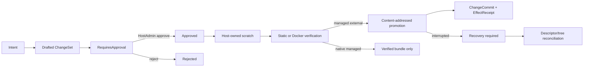

# Host Development Control Plane

> [English](./HOST_DEVELOPMENT_CONTROL_PLANE.en.md) · [中文](./HOST_DEVELOPMENT_CONTROL_PLANE.md)

The Host development control plane separates “propose a source change for a project” from “run an arbitrary command on the host.” It uses the existing constitutional sequence `Intent -> ChangeSet -> PolicyDecision -> ChangeCommit -> EffectReceipt` for causality, approval, and effects. Project resolution, scratch workspaces, Docker verification, and workspace promotion remain Host control-plane concerns; no `kernel.v1.project.*`, `kernel.v1.workspace.*`, or IDE product ontology is added.

`official/workspace-lab` remains an ordinary planning package with no execution authority. Real changes enter only through the access-token-protected `/host/v1/projects/:project_id/changes` API. Docker verification is performed by the equally ordinary `official/docker-runtime-lab`; it has no kernel privilege.

## Lifecycle

Approval and execution are separate requests. Approval covers the exact server-returned operations, verification plan, `required_authority`, and `expected_effects`; ChangeSet content cannot be replaced after approval. The Web project console renders all four next to the approval action.

## Host API

| Method | Route | Purpose |
|---|---|---|
| `GET` / `POST` | `/host/v1/projects/:project_id/changes` | List / draft ChangeSets |
| `GET` | `/host/v1/projects/:project_id/changes/:change_set_id` | Read state and durable refs |
| `GET` | `.../:change_set_id/bundle` | Export the artifact-backed JSON patch bundle |
| `POST` | `.../:change_set_id/approve` | Approve or reject the exact ChangeSet once |
| `POST` | `.../:change_set_id/execute` | Stage, verify, and promote according to ownership |
| `POST` | `.../:change_set_id/recover` | Reconcile an interrupted Docker image or managed promotion |

All routes are inside the existing Host token middleware. The current token is a Host-level gate, and `host serve` requires a non-empty token when binding a non-loopback address. Finer project/action scopes, remote identity, and delegation are next-stage work; privileged official packages are not a substitute.

## Ownership behavior

| Workspace ownership | Draft | Scratch verification | Automatic write-back |
|---|---:|---:|---:|
| `managed_external` | Yes | Yes | Yes; create a new immutable digest tree, then atomically update the descriptor |
| `native_managed` | Yes | Yes | No; the first version emits a verified bundle only |
| `linked_local` | No | No | Never; import a managed copy before Host verification |

A linked-local directory is user-owned and may change concurrently. The first version does not copy it with a check-then-use path scheme and never writes user source. Although a native workspace is Host-managed, this version still avoids an in-place multi-file transaction and delivers a verified bundle instead. Only a content-addressed managed external tree enters automatic promotion.

## File and artifact boundary

- Operations are bounded `file_write` / `file_delete` only. Absolute paths, `..`, backslashes, VCS metadata, `.env`, credential files, and duplicate targets are rejected.
- Source input is limited to 4 MiB per file and 16 MiB per request; a workspace is limited to 25,000 files, 25,000 directories, and 256 MiB.
- Snapshot copy counts bytes actually read, checks file identity/size before and after opening, and rejects hardlinks on Unix. Symlinks and special files fail closed.
- The journal stores structure, state, and artifact descriptors, not source bodies. Metadata says `source_artifact_references`; it does not falsely claim that the entire payload is redacted.
- Source bodies live in the content-addressed artifact store and are materialized by the bundle API inside the authenticated Host boundary. Never submit secrets in a ChangeSet. Fine-grained artifact scopes, encryption policy, retention and reachability GC, plus journal snapshot compaction, remain follow-up work. The current implementation retains the complete in-memory state index so pruning cannot break durable idempotency or replay consistency.

## Verification boundary

`static_validation` checks scratch structure and the final tree digest without executing project code.

`docker_build` is the only first-version project-code execution boundary:

- development scratch supports Dockerfile only; it does not invoke host Nixpacks or an arbitrary command runner;
- context must be exactly `<data>/projects/<project>/development/<change>/workspace`, and the canonical root is checked again immediately before packing;
- `network=none` is the default; `bridge` must be explicit in the ChangeSet and adds `host.network.egress` authority;
- build secrets, secret refs, host mounts, and arbitrary build-time secret parameters are rejected;
- CPU, memory, time, file-count, and byte limits apply;
- only status and a diagnostic-log SHA-256 are persisted, never raw Docker logs;
- the verification image is removed after matching `managed-by`, package, project, build, and change labels. It is not retained as a deployment image.
- container status/log/stop also carries route and port-lease scope and must match `managed-by`, package, route, and lease labels. Stop additionally requires explicit `approved: true`; an arbitrary Docker ID is never treated as a Yggdrasil resource.

## Durability, concurrency, and recovery

- Each project has its own development journal session. Transitions use EventStore `append_with_sequence_if_next` expected-tail compare-and-append; memory, SQLite, and PostgreSQL implement the same atomic semantics.
- With an idempotency key, the change id is deterministically derived from project + key. Different requests using one key conflict in the durable journal instead of relying only on a process-local map.
- The development control plane holds a global 30-second Host lease with a 10-second heartbeat. Missing lease state fails closed. Every change write checks local expiry and the durable lease tail; promotion renews before effects and checks again before descriptor activation. A second Host cannot recover or execute against the shared store concurrently, and approval, execution, and promotion stop after lease loss.
- Interrupted staging or static verification has not promoted a workspace and can fail with scratch cleanup.
- Interrupted Docker verification enters `recovery_required`; recovery uses the stable build id and full ownership labels to remove the image or confirm it is absent before recording a failed terminal state.
- Managed promotion persists old/new digests and whether the destination pre-existed before visible effects. Recovery reads the real descriptor and tree: if the descriptor points at the proposed digest, it completes the success commit; if it still points at the previous digest, it removes only a newly created, digest-matching orphan. Anything else remains recovery-required.
- The system never replays arbitrary project commands automatically and never disguises uncertain partial effects as an ordinary failure.

## Deliberately absent

- arbitrary shell, install/test command, or host command runner;
- automatic mutation of linked-local or native workspaces;
- implicit use of a verification image for deployment;
- development/project/deploy ontology in the kernel;
- a local CLI mutation path that bypasses the public Host API.

Remote CLI control, project-scoped authority, mobile control, artifact permission/GC, and richer verifiers can evolve on this same boundary.
