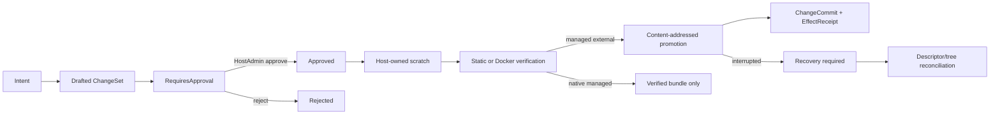

# Host 开发控制平面

> [English](./HOST_DEVELOPMENT_CONTROL_PLANE.en.md) · [中文](./HOST_DEVELOPMENT_CONTROL_PLANE.md)

Host 开发控制平面把“为一个项目提出源码变更”与“在主机上执行任意命令”严格分开。它使用现有宪法对象 `Intent -> ChangeSet -> PolicyDecision -> ChangeCommit -> EffectReceipt` 表达因果、审批和效果，但项目解析、scratch、Docker 验证和 workspace promotion 都属于 Host 控制面，不新增 `kernel.v1.project.*`、`kernel.v1.workspace.*` 或 IDE 产品本体。

`official/workspace-lab` 仍是普通、无执行权限的规划包。真实变更只能经受 access-token 保护的 `/host/v1/projects/:project_id/changes` API 进入 Host。Docker 验证由同样普通的 `official/docker-runtime-lab` 执行；它没有内核特权。

## 生命周期

审批与执行是两个独立请求。审批记录的是服务端返回的精确 operations、verification plan、`required_authority` 和 `expected_effects`；批准后不能替换 ChangeSet 内容。Web 项目控制台在批准按钮旁展示这四类信息。

## Host API

| Method | Route | 作用 |
|---|---|---|
| `GET` / `POST` | `/host/v1/projects/:project_id/changes` | 列表 / 草拟 ChangeSet |
| `GET` | `/host/v1/projects/:project_id/changes/:change_set_id` | 读取状态与 durable refs |
| `GET` | `.../:change_set_id/bundle` | 导出 artifact-backed JSON patch bundle |
| `POST` | `.../:change_set_id/approve` | 一次性批准或拒绝精确 ChangeSet |
| `POST` | `.../:change_set_id/execute` | 异步暂存、验证，并按所有权决定是否 promotion |
| `POST` | `.../:change_set_id/recover` | 对账中断的 Docker image 或 managed promotion |

这些路由位于现有 Host token middleware 内。当前 token 是 Host 级门禁；`host serve` 绑定非 loopback 地址时必须提供非空 token。更细的项目/动作 scope、远端身份和 delegation 属于下一阶段，不能通过给官方包加特权来替代。

## 所有权行为

| Workspace ownership | 草拟 | scratch 验证 | 自动写回 |
|---|---:|---:|---:|
| `managed_external` | 是 | 是 | 是；只生成新的不可变 digest tree，再原子更新 descriptor |
| `native_managed` | 是 | 是 | 否；首版只生成 verified bundle |
| `linked_local` | 否 | 否 | 永不；先导入 managed 副本才能进入 Host 验证 |

linked-local 是用户可并发修改的目录。首版不会用“先检查路径、再按路径读取”的竞态方案复制它，也不会自动写用户源码。native workspace 虽由 Host 管理，首版仍不做多文件原地事务；验证结果以 bundle 交付。只有 content-addressed managed external tree 进入自动 promotion。

## 文件与 artifact 边界

- 操作只支持有界 `file_write` / `file_delete`，拒绝绝对路径、`..`、反斜杠、VCS 元数据、`.env`、凭据文件和重复目标。
- 单文件输入最大 4 MiB，请求源码合计最大 16 MiB；workspace 最大 25,000 文件、25,000 目录和 256 MiB。
- snapshot 流式按实际读取字节计数；打开前后核对文件身份/大小，Unix 拒绝 hardlink。发现 symlink 或特殊文件会 fail-closed。
- journal 保存结构、状态和 artifact descriptor，不保存源码正文；metadata 明确标记为 `source_artifact_references`，不伪称整个 payload 已脱敏。
- 源码正文存入 content-addressed artifact store，bundle API 会在已认证 Host 边界内重新 materialize。不要在 ChangeSet 中提交 secret；artifact 细粒度 scope、加密策略、保留期与 reachability GC，以及 journal snapshot compaction 仍是后续工作。当前实现保留完整的内存状态索引，避免裁剪后破坏 durable idempotency 与重放一致性。

## 验证边界

`static_validation` 只验证 scratch 结构和最终 tree digest，不执行项目代码。

`docker_build` 是首版唯一执行项目代码的验证边界：

- 仅支持 Dockerfile，不为 development scratch 调用宿主 Nixpacks 或任意命令 runner；
- context 必须精确等于 `<data>/projects/<project>/development/<change>/workspace`，打包前再次核对 canonical root；
- 默认 `network=none`；`bridge` 必须显式出现在 ChangeSet，并加入 `host.network.egress` authority；
- 不接受 build secrets、secret refs、host mounts 或任意 build-time secret 参数；
- 构建有 CPU、内存、时间、文件数和字节上限；
- 结果只持久化状态与诊断日志 SHA-256，不保存原始 Docker log；
- 验证镜像按 `managed-by`、package、project、build 和 change 五组标签核对后删除，不作为部署镜像保留。
- 容器 status/log/stop 也必须携带 route 与 port-lease scope，并核对 `managed-by`、package、route 和 lease 标签；stop 还要求显式 `approved: true`，不能把任意 Docker ID 当作 Yggdrasil 资源。

## 持久化、并发与恢复

- 每个项目使用独立 development journal session。状态转换通过 EventStore 的 `append_with_sequence_if_next` 做 expected-tail compare-and-append；内存、SQLite 和 PostgreSQL 后端提供同一原子语义。
- 带 idempotency key 的 change id 由 project + key 确定性派生；同 key 的不同请求在 durable journal 中冲突，而不是只靠进程内 map。
- development control plane 使用 30 秒全局 Host lease、10 秒心跳。缺少租约会 fail-closed；每次变更写入会核对本地过期时间和 durable lease tail，promotion 前主动续租，并在 descriptor 激活前再次核对。第二个 Host 不能在共享 store 上同时恢复或执行；租约丢失后审批、执行和 promotion 停止。
- staging 或静态验证中断没有 workspace promotion，可标记失败并清理 scratch。
- Docker 验证中断进入 `recovery_required`；恢复按稳定 build id 和完整 ownership labels 删除或确认镜像不存在，然后记录失败终态。
- managed promotion 在可见效果前持久化旧/新 digest 与 destination 是否预先存在。恢复读取真实 descriptor 和 tree digest：descriptor 已指向新 digest 时补齐成功 commit；仍指向旧 digest 时只清理由本次创建且内容匹配的 orphan；其他状态保持 recovery required。
- 系统永不自动重放任意项目命令，也不把不确定的部分效果伪装成普通 `failed`。

## 刻意未提供

- 任意 shell、install、test command 或 host command runner；
- 自动修改 linked-local 与 native workspace；
- 将 verification image 隐式用于部署；
- 把 development/project/deploy 语义扩入内核；
- 绕过公开 Host API 的本地 CLI 写入路径。

远程 CLI、项目级 scope、移动端控制、artifact 权限/GC，以及更丰富的验证器会在相同边界上继续演化。
