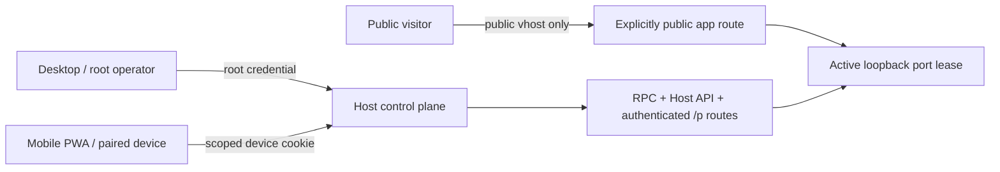

# Host Remote Access and Route Exposure

> [English](./HOST_REMOTE_ACCESS.en.md) · [中文](./HOST_REMOTE_ACCESS.md)

Yggdrasil's Web/PWA, Desktop, and future CLI are clients of the same Host. Remote access does not create a second mutation interface and does not copy the root token onto a phone. It adds revocable, expiring, action-scoped device identities in front of the existing Host API and RPC. Public application traffic is a separate, explicit data-plane boundary; configuring a domain does not publish routes implicitly.

## Two planes



- **Host control plane:** projects, deployment, ChangeSets, access management, and `/p/<route_id>/...`. A root or device identity is required and checked against action scopes.
- **Application data plane:** only a route with `route_access: public` can be reached without Host authentication through `<slug>.<app_base_domain>`.
- Static Web assets and the `/pair` page carry no authority. Reads and mutations remain behind protected APIs. The public pairing endpoints only inspect or claim a high-entropy one-time token already held by the caller.

## Identities

| Identity | Credential | Purpose |
|---|---|---|
| Host root | Bearer token from `YGG_HTTP_ACCESS_TOKEN` / `--access-token`; Desktop may exchange a one-time bootstrap nonce for a root cookie | Local administration, first authorization, and recovery; owns every scope |
| Paired device | `yggaccess.*` token; after PWA claim it exists only in the `__Host-ygg_remote_session` cookie | Routine remote control; owns only the grant's scopes |

Optional authentication with no configured root token is a loopback development mode. `host serve` refuses a non-loopback bind without a non-empty root token. The root token is a root credential and must never enter a pairing URL, browser persistence, application upstream, or logs.

## Scopes

| Scope | Authority boundary |
|---|---|
| `observe` | Read Host / project / package / target / exec / port / proxy state and open Host-authenticated `/p` routes |
| `project_operate` | Start and stop projects and manage project sessions |
| `deploy` | Deploy, cancel deployment jobs, and mutate target / exec / port / proxy state |
| `develop_propose` | Read development ChangeSets and draft a new ChangeSet |
| `develop_approve` | Approve or reject the exact ChangeSet |
| `develop_execute` | Execute or recover an approved ChangeSet |
| `access_manage` | Inspect devices and invitations, create/cancel pairings, and revoke grants |

Unknown HTTP paths, unknown RPC methods, and broad administrative mutations require `access_manage`, so scoped devices fail closed. A new grant must be a subset of the caller's authority and must contain `observe`; only root can delegate `access_manage`. The Web UI selects only `observe` by default, and each additional action is explicit.

Scopes are currently Host action scopes, not a project-level tenant boundary. Hardening project identity through `ProtocolContext.session_id` remains separate follow-up work.

## Pairing lifecycle

1. A client with `access_manage` calls `POST /host/v1/access/pairings` with a device name, scopes, and expiration.
2. The Host returns a one-time `yggpair.*` token valid for at most ten minutes. The Web UI places it in `/pair` under an operator-supplied HTTPS Host origin.
3. The new device removes the token from the address bar immediately and retains it in memory only. It first calls the public inspect endpoint so the user can verify device name, scopes, and expiry.
4. On confirmation, the public claim endpoint atomically consumes the pairing, creates a grant valid for at most 365 days, and sets a Secure, HttpOnly, SameSite=Strict, host-only cookie.
5. Expired or revoked grants fail on the next authentication check. Revoking the current device also clears its cookie. A pending pairing can be cancelled before claim.

Routes:

| Authentication | Method / route | Purpose |
|---|---|---|
| public + pairing token | `POST /host/v1/access/pair/inspect` | Inspect an invitation before consuming it |
| public + pairing token | `POST /host/v1/access/pair` | Claim a grant once |
| any Host identity | `GET /host/v1/access/me` | Inspect the current identity and scopes |
| `access_manage` | `GET /host/v1/access` | Inspect grant and pairing projections |
| `access_manage` | `POST /host/v1/access/pairings` | Create an invitation |
| `access_manage` | `POST .../pairings/:id/cancel` | Cancel a pending invitation |
| `access_manage` | `POST .../grants/:id/revoke` | Revoke a device grant |
| any Host identity | `POST /host/v1/access/logout` | Clear browser Host cookies |

## Persistence and credential boundary

- Pairing and grant transitions are written to the dedicated `host_control_access` EventStore journal. SQLite and PostgreSQL Hosts rehydrate the same projection after restart.
- The journal stores only domain-separated SHA-256 credential digests, never pairing tokens, access tokens, or cookie values.
- Pairing claim/cancel and grant revoke use expected-tail compare-and-append. Only one concurrent claim can commit.
- Grant revocation and expiry are checked on every authentication, rather than relying on the browser to refresh state.
- Bearer and cookie credentials have explicit precedence. Query credentials are accepted only by `GET /kernel/v1/event.subscribe/:session_id` and `GET /host/v1/build-deploy/:job_id/events`, the two browser SSE entry points; no other route treats a URL token as a credential.

## HTTPS and same-origin requirements

Remote PWA control requires an HTTPS origin. The pairing screen refuses claim over plaintext HTTP because the `__Host-` cookie must be Secure, host-only, and use `Path=/`.

A production topology places the Host behind a TLS reverse proxy or trusted overlay:

```bash
YGG_HTTP_ACCESS_TOKEN='<high-entropy-root-token>' \
  ygg host serve --http 0.0.0.0:8787 --static-dir clients/web/dist
```

Firewall the plaintext port so only the proxy/overlay can reach it; expose an origin such as `https://host.example.com`. The proxy must preserve the original `Host` and allow the browser's `Origin` to reach the Host. Cookie-authenticated `POST` / `PUT` / `PATCH` / `DELETE` requests with an Origin that does not match Host receive 403. Native clients that omit Origin may still use a Bearer token. There is no cross-origin CORS control API.

## Application route exposure

`kernel.v1.proxy.register` and deployment descriptors use:

```yaml
route_access: host_authenticated # default; old descriptors resolve this way
# route_access: public           # requires an explicit user choice
```

- `host_authenticated`: exposes only `/p/<route_id>/...`, inside Host authentication and requiring at least `observe`.
- `public`: when `--app-base-domain` is configured, additionally enables the derived vhost; only that vhost bypasses Host authentication. Without a base domain, the authenticated `/p` fallback is still the only entry.
- Route access is written into proxy registration events and durable deployment revisions; recover and rollback preserve the original choice.
- A public vhost does not forward Host `Authorization`, Ygg query tokens, Host session cookies, or `Referer` to the app. The upstream must remain an active, ready loopback lease.

A public route's application owns internet-input validation, application identity, CSRF protection, rate limiting, and content security. A Yggdrasil Host grant is not an application user system.

## Deliberately absent

- Remote execution targets or remote package transport; deployed upstreams remain local loopback services.
- Project-isolated multi-tenant identities and cross-Host delegation chains.
- Automatic root-token synchronization to phones, or a local CLI mutation path that bypasses the Host API.
- Deployment, public routes, or side-effect replay without explicit user confirmation.
- Application login, public CORS, or internet-edge protection supplied on behalf of deployed apps.
