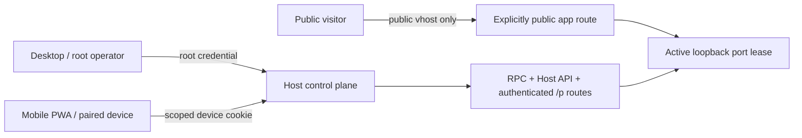

# Host 远程访问与路由暴露

> [English](./HOST_REMOTE_ACCESS.en.md) · [中文](./HOST_REMOTE_ACCESS.md)

Yggdrasil 的 Web/PWA、桌面和后续 CLI 都是同一个 Host 的客户端。远程访问不会建立第二套写入接口，也不会把 root token 复制到手机；它在现有 Host API / RPC 前增加可撤销、可过期、按动作衰减的设备身份。应用数据面的公开访问则是另一条显式边界，不能由“配置了域名”隐式开启。

## 两个平面



- **Host 控制平面：** 项目、部署、ChangeSet、访问授权和 `/p/<route_id>/...`。需要 root 或设备身份，并按动作 scope 检查。
- **应用数据平面：** 只有 `route_access: public` 的 route 才能经 `<slug>.<app_base_domain>` 免 Host 认证访问。
- Web 静态文件和 `/pair` 页面本身不构成权限；真正的读取和修改仍在受保护 API 后面。公开 pairing API 只有持有一次性高熵 token 的调用者才能 inspect / claim。

## 身份

| 身份 | 凭据 | 用途 |
|---|---|---|
| Host root | `YGG_HTTP_ACCESS_TOKEN` / `--access-token` 的 Bearer token；桌面可通过一次性 bootstrap 换取 root cookie | 本机管理、首次授权、紧急恢复；拥有全部 scope |
| Paired device | `yggaccess.*` token；PWA claim 后只放入 `__Host-ygg_remote_session` Cookie | 日常远程控制；仅拥有 grant 中列出的 scope |

未配置 root token 时的可选认证只用于 loopback 开发。`host serve` 绑定非 loopback 地址时会拒绝没有非空 root token 的启动。root token 是根凭据，不应进入 pairing URL、浏览器持久存储、应用上游或日志。

## Scope

| Scope | 能力边界 |
|---|---|
| `observe` | 读取 Host / 项目 / package / target / exec / port / proxy 状态，以及访问受 Host 认证的 `/p` route |
| `project_operate` | 启动、停止项目和管理项目 session |
| `deploy` | 部署、取消部署任务，以及 target / exec / port / proxy 变更 |
| `develop_propose` | 读取开发 ChangeSet 并草拟新 ChangeSet |
| `develop_approve` | 批准或拒绝精确 ChangeSet |
| `develop_execute` | 执行或恢复已批准 ChangeSet |
| `access_manage` | 查看设备和邀请、创建/取消 pairing、撤销 grant |

未知 HTTP 路径、未知 RPC 方法和宽泛管理变更默认需要 `access_manage`，因此 scoped device 会 fail closed。新 grant 只能是调用者权限的子集，必须包含 `observe`；只有 root 可以把 `access_manage` 授予新设备。Web UI 默认只选择 `observe`，额外动作必须逐项开启。

当前 scope 是 Host 动作级，不是项目级租户边界。`ProtocolContext.session_id` 的项目身份加固仍是独立后续工作。

## Pairing 生命周期

1. 拥有 `access_manage` 的客户端调用 `POST /host/v1/access/pairings`，提交设备名、scope 和期限。
2. Host 返回最多存活 10 分钟的一次性 `yggpair.*` token。Web UI 把它放进用户指定的 HTTPS Host origin 下的 `/pair` URL。
3. 新设备打开链接后立即从地址栏清除 token，只在内存中保留；先调用公开 inspect，让用户核对设备名、scope 和过期时间。
4. 用户确认后调用公开 claim。Host 原子消费 pairing，创建最长 365 天的 grant，并设置 Secure、HttpOnly、SameSite=Strict、host-only Cookie。
5. grant 到期或被撤销后，每次认证都会立即失败；撤销当前设备还会清除其 Cookie。pending pairing 可在领取前取消。

相关路由：

| 认证 | Method / route | 作用 |
|---|---|---|
| public + pairing token | `POST /host/v1/access/pair/inspect` | 在消费前查看邀请内容 |
| public + pairing token | `POST /host/v1/access/pair` | 一次性领取 grant |
| any Host identity | `GET /host/v1/access/me` | 查看当前身份和 scope |
| `access_manage` | `GET /host/v1/access` | 查看 grant 与 pairing 投影 |
| `access_manage` | `POST /host/v1/access/pairings` | 创建邀请 |
| `access_manage` | `POST .../pairings/:id/cancel` | 取消 pending 邀请 |
| `access_manage` | `POST .../grants/:id/revoke` | 撤销设备 grant |
| any Host identity | `POST /host/v1/access/logout` | 清除浏览器 Host Cookie |

## 持久化与凭据边界

- pairing 和 grant 转换写入 EventStore 的专用 `host_control_access` journal；SQLite / PostgreSQL Host 重启后重新水化同一投影。
- journal 只保存带 domain separation 的 SHA-256 credential digest，不保存 pairing token、access token 或 Cookie 原值。
- pairing claim、cancel、grant revoke 使用 expected-tail compare-and-append；并发领取只有一个能成功。
- grant 的撤销和过期在每次认证时检查，不依赖浏览器主动刷新状态。
- Bearer / Cookie 有明确优先级。查询参数凭据仅允许在 `GET /kernel/v1/event.subscribe/:session_id` 和 `GET /host/v1/build-deploy/:job_id/events` 这两个浏览器 SSE 入口使用；其他路径不会把 URL token 当作凭据。

## HTTPS 与同源要求

远程 PWA 只支持 HTTPS origin。Pairing 页面在明文 HTTP 下拒绝领取，因为 `__Host-` Cookie 必须同时满足 Secure、host-only 和 `Path=/`。

生产拓扑应把 Host 放在 TLS 反向代理或可信 overlay 后：

```bash
YGG_HTTP_ACCESS_TOKEN='<high-entropy-root-token>' \
  ygg host serve --http 0.0.0.0:8787 --static-dir clients/web/dist
```

裸 HTTP 端口必须由防火墙限制在代理/overlay 内；外部 origin 例如 `https://host.example.com`。代理必须保留原始 `Host`，并让浏览器的 `Origin` 到达 Host。Cookie 认证的 `POST` / `PUT` / `PATCH` / `DELETE` 若携带的 Origin 与 Host 不一致会返回 403；没有 Origin 的原生客户端仍可使用 Bearer token。系统不提供跨源 CORS 控制 API。

## 应用 route 暴露

`kernel.v1.proxy.register` 和部署描述符使用：

```yaml
route_access: host_authenticated # 默认；旧描述符也按此解释
# route_access: public           # 必须由用户显式选择
```

- `host_authenticated`：只提供 `/p/<route_id>/...`；它位于 Host auth middleware 内，至少需要 `observe`。
- `public`：在配置 `--app-base-domain` 后额外启用派生 vhost，且只有该 vhost 绕过 Host 认证。没有 base domain 时仍只有受保护的 `/p` fallback。
- route access 会写进 proxy 注册事件和 durable deployment revision，recover / rollback 保留原选择。
- public vhost 不把 Host `Authorization`、Ygg query token、Host session Cookie 或 `Referer` 转发给应用；upstream 仍必须是 active、ready 的 loopback lease。

公开 route 的应用必须自己承担互联网输入、应用级身份、CSRF、速率限制和内容安全。Yggdrasil 的 Host grant 不是应用用户系统。

## 刻意未提供

- 远程执行 target 或远端 package transport；当前部署 upstream 仍在本机 loopback。
- 按项目隔离的多租户身份和跨 Host delegation chain。
- 把 root token 自动同步到手机，或用本地 CLI 绕开 Host API 写入。
- 未经用户确认的部署、公开 route 或自动重放副作用。
- 为被部署应用代做登录、公开 CORS 或互联网边缘防护。
