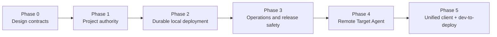

# Host Operations Implementation Roadmap

> [English](./HOST_OPERATIONS_IMPLEMENTATION.en.md) · [中文](./HOST_OPERATIONS_IMPLEMENTATION.md)

This roadmap turns project-scoped authority, reliable deployment, operational safety, and remote targets into dependency-ordered delivery phases. It does not replace the Charter or Contract V1; new contracts mature through Experimental and Candidate status.

## Outcome

From Desktop, Web/PWA, or CLI, a user can pair a device constrained to projects/targets, intake an external project, approve an assistant-drafted ChangeSet, produce a verified artifact with provenance, select a local or remote preview target, safely activate after health checks, recover from Host/Agent failure, roll back to a reachable revision, and trace the entire action through grant, policy, artifact, operation, and receipt. Official packages and UI use the same public contract.

## Dependency graph

Some release/health work may develop alongside Phase 2, but remote targets do not activate before Phase 1 and 2 gates.

## Implementation progress

| Phase | Status | Current result |
|---|---|---|
| Phase 0 | Complete | Bilingual design contracts, threats, and failure boundaries are frozen as the implementation baseline |
| Phase 1 | Candidate implementation complete | Project/target authority, delegation, server-side filtering, Web/CLI, and redacted decision journals are closed; GitHub CI validates the full matrix |
| Phase 2 | Candidate implementation complete | Durable deployment intent/operation/lease/receipt, candidate-first activation, reconcile/recover/rollback, and bounded restart policy are closed and validated by GitHub CI |
| Phase 3 | Candidate implementation complete | Non-destructive data migration, backup/verify/restore, live/ready, release integrity, SBOM, and provenance are closed and validated by GitHub CI |
| Phase 4 | In progress | Identity/observation, typed-worker, reachability driver, equivalent Docker deployment, actual-port lease projection, and the authenticated reverse-tunnel/private-preview Candidate baseline are implemented; the remaining gate is GitHub CI closure for remote HTTP/WebSocket, reconnect/revoke/backpressure/stale-epoch faults, and explicit public-route acceptance |
| Phase 5 | Not started | It remains gated on the Remote Target Agent and will not add client-only bypasses |

## Phase 0: design contracts

Deliver project authority, durable deployment, target agent, operations/data/release documents, this roadmap, threat tables, failure matrices, compatibility, and migration boundaries. Gate: Project/target/deploy remain Host Control Plane resources and remote client/target/package boundaries are unambiguous.

## Phase 1: project authority

Slices: additive authenticated context and structured resource selectors; full HTTP/root/device propagation; verified session/project/object binding; scoped pairing/grants and delegation migration; server-side filtering and surface attenuation; Web/CLI grant management.

Gate: cross-project matrix, alias/direct transport equivalence, concurrent revocation, and credential-exclusion tests pass.

## Phase 2: durable local deployment

Slices: intent/operation/lease/receipt projections with dual write; Build Artifact separation; local observation and ledger; candidate-first health/atomic activation/drain; unified startup reconcile/recover/rollback/cancel; bounded restart and CrashLoopBackoff.

Gate: Host kill/restart at every phase causes no duplicate effect or premature healthy-version stop and converges or enters explicit NeedsAttention.

## Phase 3: operations and release safety

Slices: classified data and migration ledger with no silent reset; backup/verify/restore; live/ready/status and unified health policy; redacted diagnostics and metrics; locked/pinned release gate with checksum/SBOM/provenance/installer smoke; topology and recovery runbooks.

Gate: old-data upgrade→backup→restore, store/object/secret faults, installers, and provenance pass GitHub CI.

## Phase 4: Remote Target Agent

Slices: durable target registry/enrollment/heartbeat/observe; target driver router and local conformance; agent ledger/authority/idempotency/fencing; artifact and verifier transport; deployment/actual ports/authenticated tunnel/private preview; explicit public route, with target-edge work deferred.

The code now covers slices 1–5 and can reuse the Host's existing explicit `public` route mode for remote workloads. Phase 4 remains In progress until the complete remote-tunnel/failure/public-route acceptance matrix passes; an exposed endpoint alone is not the gate.

Gate: crashes, duplicates, reordering, reconnect, revoke, corruption, and stale epochs never produce duplicate or unauthorized effects.

## Phase 5: unified client and development-to-deployment

Slices: Host connection profiles and project/target context in shared client-core; desktop local default plus explicit remote Host; shared Web/PWA UI and only a thin native-mobile wrapper when needed; CLI over the same API/grant; Project Console operations/revisions/logs/rollback; Verified Artifact as deployment-preview input with approval/provenance.

Gate: one real external project completes propose→verify→preview→approve→activate→recover→rollback from different clients without a client-only bypass.

## Explicit non-goals

No general remote shell; no remote target before project authority; no automatic restart before operation/reconcile; no arbitrary network upstream relaxation; no Project/Docker/target/deployment substrate ontology; no Remote package/Target Agent merge; no initial multi-Host scheduler/HA/secret federation; no duplicate native-mobile business logic; no privileged pressure-project path.

## Commit, push, and CI discipline

- Each phase is an independently traceable commit group and is pushed after its gate.
- Schemas and SDKs are generated, never hand-edited.
- Local runs are limited to formatting, static checks, and targeted light tests. Full workspace, conformance, fault injection, Docker, migration/restore, installer, and cross-platform matrices run in GitHub CI.
- CI fixes append commits instead of rewriting pushed phase history.
- A phase includes code, contract, migration, documentation, and tests; an exposed endpoint alone is not completion.

## Real-project pressure

Do not create a privileged demo. Use a real external project through public Host contracts as an acceptance workload, plus a second small, structurally different fixture to verify replaceability. Domain semantics never enter the substrate.
