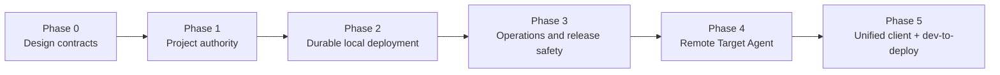

# Host Operations 实施路线

> [English](./HOST_OPERATIONS_IMPLEMENTATION.en.md) · [中文](./HOST_OPERATIONS_IMPLEMENTATION.md)

本文把项目级权威、可靠部署、运行安全和 remote target 设计转换为有严格依赖关系的实施阶段。它不改变 Charter 或 Contract V1 的规范地位；新增合同按 Experimental → Candidate 过程成熟。

## 总目标

一个用户应能从 Desktop、Web/PWA 或 CLI：

1. 配对一个只允许访问指定项目和 target 的设备；
2. 接入外部项目并让 assistant 起草受控 ChangeSet；
3. 运行声明式 verifier，得到带 digest/provenance 的 Verified Artifact；
4. 显式选择 local 或 remote target，创建私有 preview；
5. 审批后安全激活，旧 revision 在 candidate 健康前继续服务；
6. 在 Host/Agent 崩溃、断线或重启后恢复；
7. 回滚到仍可达的以前 revision；
8. 从用户动作追溯到 grant、policy decision、artifact、operation 和 effect receipt。

任何官方 package 或 UI 都只能使用相同公开合同。

## 依赖图

Phase 3 的部分 release/health 改动可以与 Phase 2 并行开发，但 remote target 不得在 Phase 1、2 的安全门槛前启用。

## Phase 0：设计合同

交付：

- [`HOST_PROJECT_AUTHORITY.md`](../architecture/HOST_PROJECT_AUTHORITY.md)；
- [`DURABLE_DEPLOYMENT_CONTROLLER.md`](../architecture/DURABLE_DEPLOYMENT_CONTROLLER.md)；
- [`TARGET_AGENT_PROTOCOL.md`](../architecture/TARGET_AGENT_PROTOCOL.md)；
- [`OPERATIONS_DATA_RELEASE.md`](../architecture/OPERATIONS_DATA_RELEASE.md)；
- 本路线、威胁表、故障矩阵、兼容与迁移边界。

门槛：文档互不矛盾；Project/target/deploy 保持 Host Control Plane 归属；remote client/target/package 清楚分离。

## Phase 1：项目级权威

实施切片：

1. additive 的 authenticated context、ResourceRef 和 resource selectors；
2. HTTP/root/device 身份贯穿 protocol dispatch；
3. session/project/object verified binding；
4. project/target-scoped pairing/grant、delegation 与 migration；
5. server-side list/event filtering，surface handle attenuation；
6. Web Settings 和 CLI 的 grant 管理。

门槛：跨项目授权矩阵、alias/direct transport 等价、revocation 并发和 credential-exclusion tests 全通过。

## Phase 2：可靠本地部署

实施切片：

1. DeploymentIntent/Operation/lease/receipt 投影，旧流程双写；
2. Build Artifact 与 Deploy 分离；
3. local target 的实际 observation 和 operation ledger；
4. candidate-first、health gate、atomic activation、previous drain；
5. startup reconcile、recover/rollback/cancel 统一；
6. 有界 restart policy 和 CrashLoopBackoff。

门槛：在每个 phase 的 Host kill/restart 故障矩阵中，无重复 effect、无健康旧版本提前下线、可确定恢复或进入 NeedsAttention。

## Phase 3：运行和发行安全

实施切片：

1. 数据分类、schema/migration ledger，移除静默 destructive reset；
2. backup create/inspect/verify/restore 与恢复演练；
3. live/ready/status、统一 deployment health policy、脱敏 diagnostics；
4. structured tracing 与最小 metrics；
5. locked/pinned release gate、checksum、SBOM、provenance、installer smoke；
6. 支持拓扑和升级/恢复 runbook。

门槛：旧数据升级→备份→恢复 round trip、store/object/secret 故障、平台 installer smoke 和资产 provenance 在 GitHub CI 通过。

## Phase 4：Remote Target Agent

实施切片：

1. durable target registry、enrollment identity、heartbeat/negotiation/observe；
2. target driver router，local driver 通过同一 conformance；
3. Agent operation ledger、authority、idempotency 和 fencing；
4. artifact transfer 与 declarative verifier；
5. deployment/actual port lease/authenticated tunnel/private preview；
6. 显式 public route；target-side edge 另立后续设计。

门槛：Controller/Agent 任意 step 崩溃、重复/乱序请求、断线重连、revoke、artifact corruption 和 stale epoch 不产生重复或越权 effect。

## Phase 5：统一客户端与开发—部署闭环

实施切片：

1. shared client-core 增加 Host connection profile、当前 project/target context；
2. Desktop 保持 managed-local 默认并支持显式 remote Host；
3. Web/PWA 复用同一 UI；原生移动只在系统能力确实需要时做薄壳；
4. CLI 使用同一 Host API/device grant；
5. Project Console 接入 target、operation、revision、logs、rollback；
6. Development Verified Artifact 成为 deployment preview 的输入，保留审批/provenance。

门槛：同一真实外部项目可从不同客户端完成 propose→verify→preview→approve→activate→recover→rollback，不存在客户端专属旁路。

## 明确不做

- 不增加通用远程 shell；
- 不在项目权威前开放 remote target；
- 不在 operation/reconcile 前做自动重启；
- 不放宽 loopback proxy 为任意网络 upstream；
- 不把 Project、Docker、target 或 deployment 放进 substrate；
- 不把 Remote package 与 Target Agent 合并；
- 不先建多 Host scheduler/HA/federated secret；
- 不复制一套原生移动业务逻辑；
- 不为压力项目增加官方特权或硬编码领域语义。

## 提交、推送与 CI 纪律

- 每个 Phase 形成独立可回溯 commit 组；Phase gate 满足后推送 `main`。
- schema 和 SDK 只通过仓库 generator 更新，不手改生成物。
- 本机只运行格式、静态检查和定向轻量测试；完整 workspace、conformance、故障注入、Docker、migration/restore、installer 和跨平台矩阵交给 GitHub CI。
- CI 失败优先追加修复 commit；不重写已经推送的 Phase 历史。
- Phase 完成意味着代码、合同、迁移、文档和测试共同闭环，不以“接口已出现”代替行为验收。

## 真实项目的作用

不另造特权 demo。选择一个真实外部项目作为持续 acceptance workload，只通过公开 Host 合同接入。它负责暴露能力缺口，但其领域模型、构建工具和 UI 不能进入 substrate。至少保留第二个不同形态的小型 fixture 做可替换性检查，避免平台只适配单一项目。
